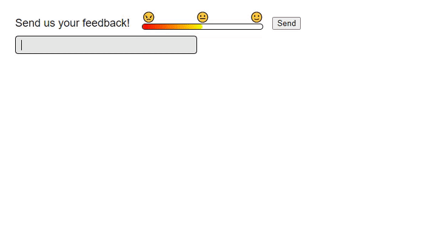

# Feedback Sentiment

[Try it out!](https://dylancyclone.github.io/feedback-sentiment/)

I always love and welcome constructive criticism, but when "feedback" becomes unconstructive and borderline insulting... this is one way of handling it.

## How to run

Either click the link above, or open `index.html` using whatever method you like best. It is a 100% static page so it doesn't have to be hosted or served in any way.

## How it works

As you type into the feedback box, your words will be processed by a sentiment analyzer (described below) and rated based on how positive or negative they are.
This is displayed in the colored bar above the input.
If your feedback is deemed unconstructive or insulting (having a sentiment score), the input field will break open and a trash can will come out under the hole.
Any new letters that are typed fall out of the input box and fall directly into the trash.
It's not until the offending word is removed (raising the sentiment score) that the input box returns to its normal functioning state.

Do note that this is a primitive and naive implementation of a joke idea, so it's probably pretty easy to break. Have fun!

## Credits

This project uses the package [sentiment by thisandagain](https://github.com/thisandagain/sentiment/), however in an effort to make this not depend on node it has been run through browserify and minified.
